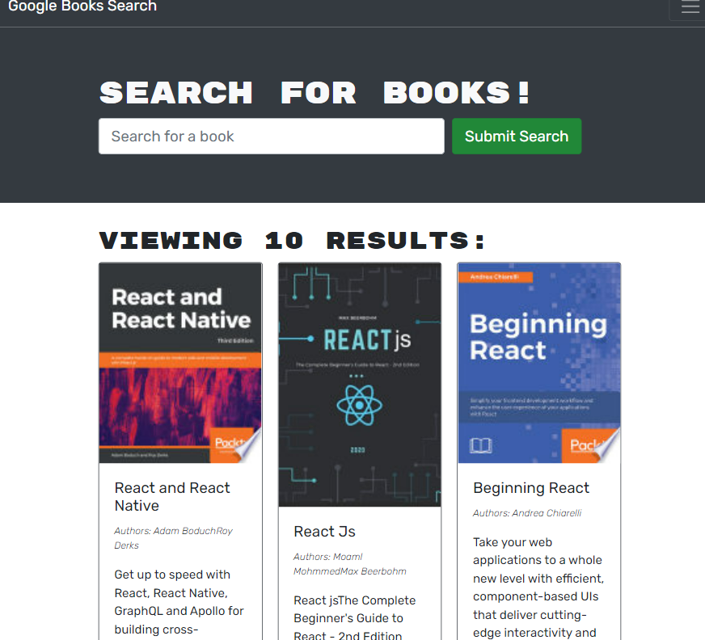
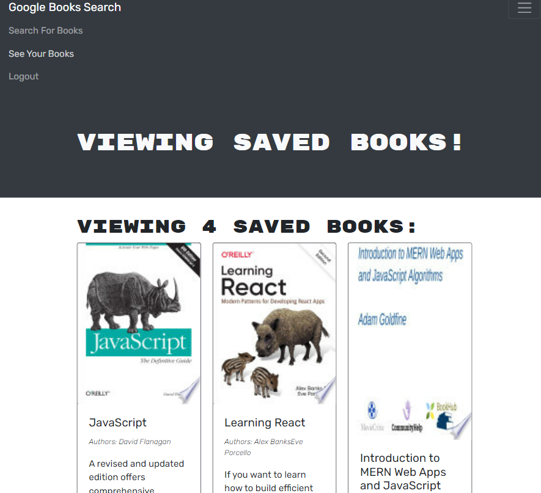
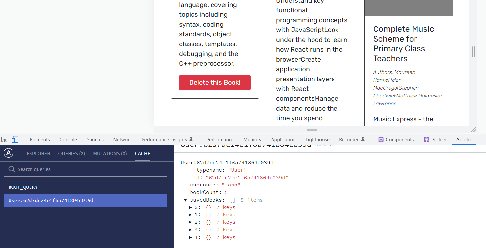
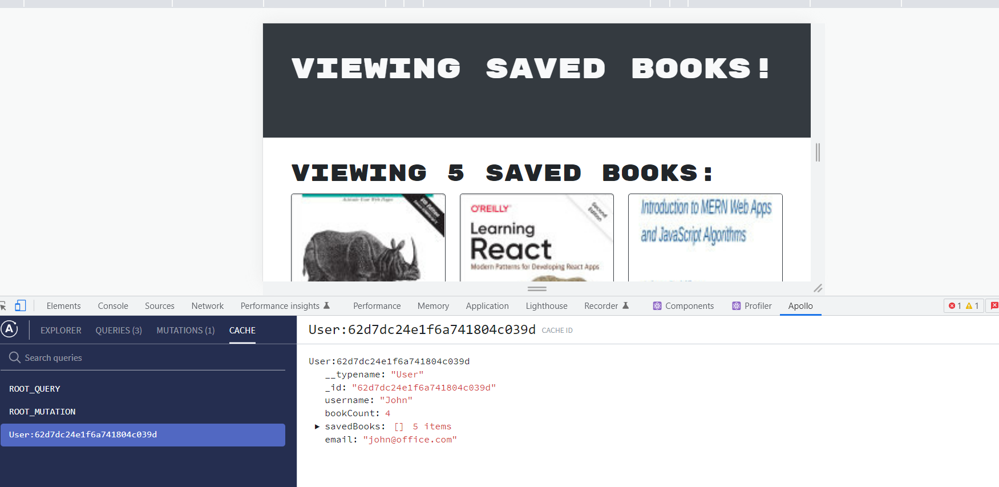
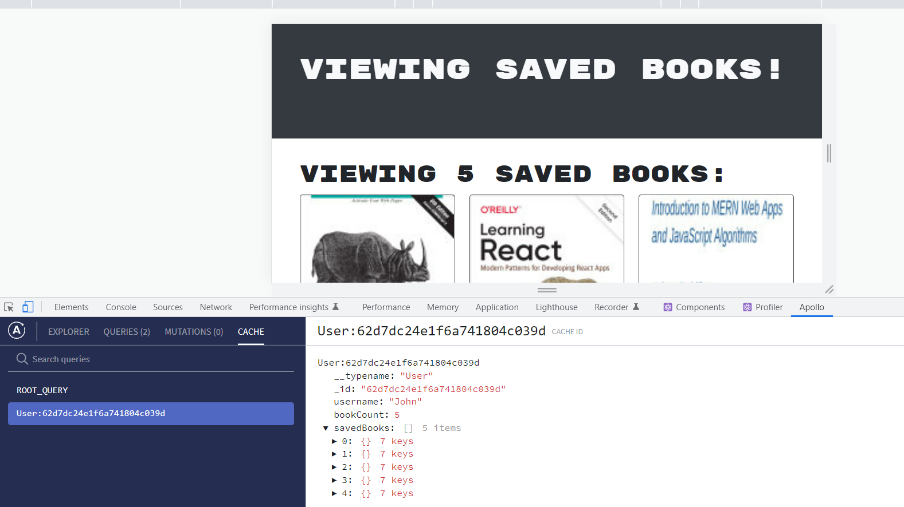

# MERN - Book Search Engine

Refactoring starter code with a fully functional Google Books API search engine built with the RESTful API to be a GraphQL API built with Apollo Server. The app was built using the MERN stack with a React front end, MongoDB database, and Node.js/Express.js server and API.

# Functionality of this app

The app was built using the MERN stack with a React front end, MongoDB database, and Node.js/Express.js server and API.

# Installation

- Download or clone repository.
- Node.js is required to run the application
- npm install to install the required packages as per package.json

# Usage

- use the following link to open the application
- The application will run on any browser.

# live application - [Book Search Engine](https://booksearchks.herokuapp.com/)

# Below are the sample pages of command line application

## Search result

## Saved books

## saved books are cached

## Mutation in saved books

## updated saved books in cache

# Features and Technologies uses

- MongoDB
- Express.Js
- React.js
- Node.js
- GraphQL
- Apollo Server

## Under the MIT license

